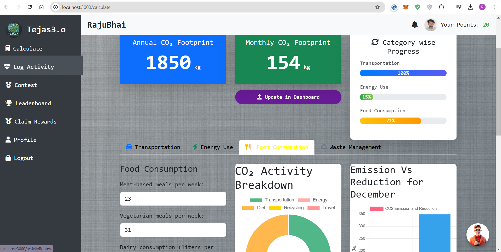
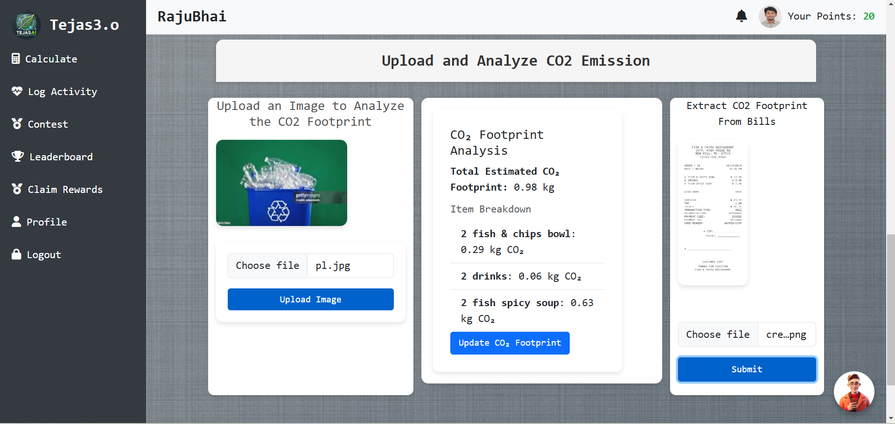
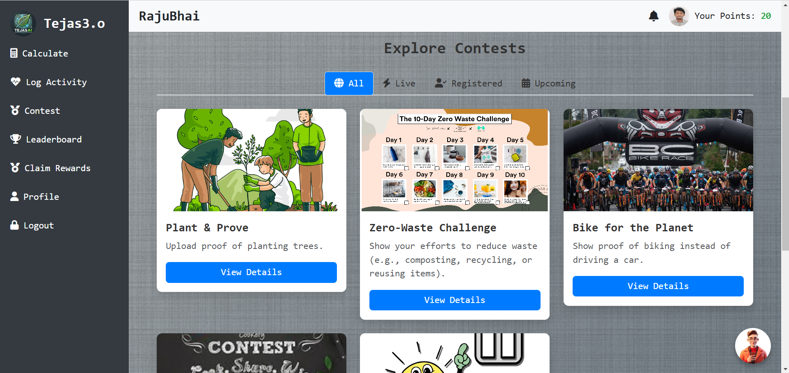
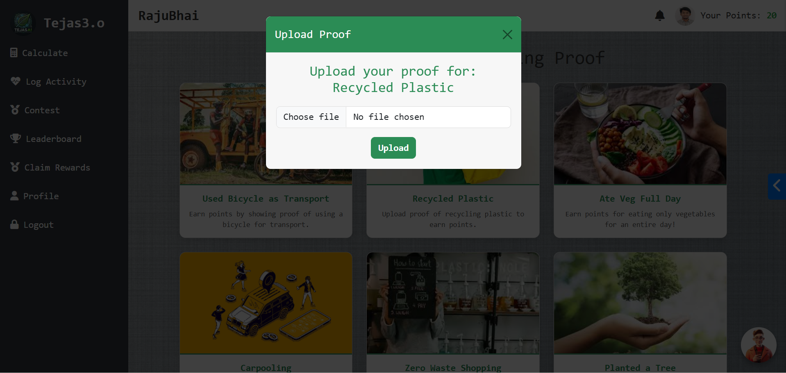

# 🌿 **Tejas AI - Gamified CO2 Footprint Tracker**



## 🌟 **Project Overview**
Tejas AI is an innovative application designed to help users **track, reduce, and gamify their carbon footprint reduction efforts**. By leveraging **AI-powered insights** and **gamification techniques**, we aim to make sustainability both **fun and impactful**! 🌍✨

---

## 💡 **Features**


- 📊 **Dashboard**: Displays **real-time CO2 emissions vs. reductions** with actionable insights.
- 🖼️ **Image Recognition**: Upload images to validate eco-friendly actions and earn **reward points**.
- 🤖 **AI-Powered Suggestions**: Get tailored recommendations to reduce your carbon footprint.
- 🏆 **Leaderboard**: Compete with other users and aim to top the chart of eco-warriors!
- 🌱 **Gamified Experience**: Earn rewards and track your progress in an engaging way.

---

## 🛠️ **Tech Stack**


- **Frontend**: **Next.js** (with [`next/font`](https://nextjs.org/docs/app/building-your-application/optimizing/fonts) for font optimization)
- **Backend**: Node.js, Express.js
- **Database**: MongoDB
- **Authentication**: **AWS Cognito** for user authentication
- **Notifications**: **AWS SNS** for sending SMS notifications
- **AI Services**:
  - **Meta-Llama-3.1-405B-Instruct**: For chatbot and eco-friendly suggestions
  - **Llama-3.2-90B-Vision-Instruct**: For analyzing CO2 emissions from user-uploaded images
  - **AWS Rekognition**: For analyzing the image and giving reward points to the user
  - **AWS Lambda**: To integrate with **Cohere Foundation's LLM model**

---


## 🚀 **Getting Started**
### 🔧 **Installation**
1. Clone the repository:
   ```bash
   git clone https://github.com/your-username/tejas-ai.git

This is a [Next.js](https://nextjs.org) project bootstrapped with [`create-next-app`](https://github.com/vercel/next.js/tree/canary/packages/create-next-app).

## Getting Started

First, run the development server:

```bash
npm run dev
# or
yarn dev
# or
pnpm dev
# or
bun dev
```

Open [http://localhost:3000](http://localhost:3000) with your browser to see the result.

You can start editing the page by modifying `app/page.js`. The page auto-updates as you edit the file.

This project uses [`next/font`](https://nextjs.org/docs/app/building-your-application/optimizing/fonts) to automatically optimize and load [Geist](https://vercel.com/font), a new font family for Vercel.

## Learn More

To learn more about Next.js, take a look at the following resources:

- [Next.js Documentation](https://nextjs.org/docs) - learn about Next.js features and API.
- [Learn Next.js](https://nextjs.org/learn) - an interactive Next.js tutorial.

You can check out [the Next.js GitHub repository](https://github.com/vercel/next.js) - your feedback and contributions are welcome!

## Deploy on Vercel

The easiest way to deploy your Next.js app is to use the [Vercel Platform](https://vercel.com/new?utm_medium=default-template&filter=next.js&utm_source=create-next-app&utm_campaign=create-next-app-readme) from the creators of Next.js.

Check out our [Next.js deployment documentation](https://nextjs.org/docs/app/building-your-application/deploying) for more details.
=======
# TejasAI-2.0
>>>>>>> 8bf12ba9f864aa2481712063c6bb649cc83c4d51
